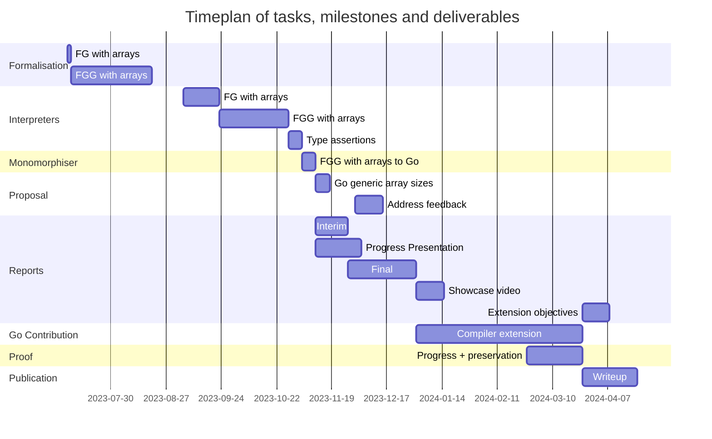

# Generic array sizes in the Go programming language

## Project aims

The aims of the project are to formalise arrays as found in the Go programming
language, design and formalise an extension to generics (parametric
polymorphism) that allow for type parameters in array sizes, and to implement an
interpreter and monomorphiser for a subset of Go with this new feature. The
design is to be submitted as a proposal to the Go open-source community, and any
feedback should be addressed. An extension to the project would be to actually
contribute this feature to the Go compiler.

## Project objectives

- Investigate how this problem has been solved in other programming languages,
  and what research has been done in this area.
- Formalise the syntax, reduction and typing rules of arrays in Go, based on
  Featherweight Go, referred to as FG going forward (Griesemer et al., 2020).
- Design and formalise the syntax, reduction and typing rules of generically
  sized arrays, based on Featherweight Generic Go, updated with the existing
  state of generics in Go, referred to as FGG going forward (Griesemer et al.,
  2020).
- Implement and test a typecheker and interpreter for FG extended
  with support for arrays.
- Implement and test a typecheker and interpreter for FGG
  extended with support for generically sized arrays.
- Implement and test a monomorphiser that translates code written in the
  extended FGG into real Go code.
- Submit a proposal to the open source community, addressing the challenges
  previously discussed by the community, and address any feedback for my design.
- Extension: formally prove the correctness (progress and preservation) of the
  addition of generally sized arrays to FGG.
- Extension: write and submit a publication to an academic journal to share my
  theoretical findings for the perusal of other researchers.
- Extension: implement generally sized arrays in the official Go compiler.

## Alignment with learning outcomes of programme of study

Implementing the interpreters and monomorphisers will test my ability to
"design, implement and test algorithms and larger programmes in a rigorous and
principled way".

Working closely with my supervisor to formalise and design the syntax, reduction
rules and typing rules aligns with the ability to "Analyse and solve technical
problems effectively, both individually and as part of a design team".

Learning how to formalise a language into its syntax, reduction rules and typing
rules will "demonstrate awareness and understanding of the mathematical,
scientific and engineering foundations of the discipline of computer science".

Writing the report, delivering the showcase video and submitting a proposal to
the Go community will test my ability to "communicate technical detail
effectively to a variety of audiences, both through production of well-written
technical reports and through oral presentation / demonstration".

Identifying and describing example use-cases of my solution will align with the
ability to "Connect information and ideas within the broader context of the
discipline of computer science".

## Methodology

In order to understand how to formally describe a programming language, I will
work closely with my supervisor and analyse previous works in this area. I will
the use what I've learnt to formally describe the generic arrays extension I
wish to introduce to the Go language.

I will regularly discuss my design with my supervisor and iterate upon it until
reaching a satisfactory result, after which I will implement the interpreters
and monomorphiser with a subset of the Go language to verify my design.
Following this, I will submit a proposal to the Go open-source community
discussing my design and addressing any implementation challenges, and iterate
my design accordingly based on any feedback.

When implementing any software, I will adhere to the Test-Driven Development
paradigm, as it facilitates incrementally increasing the complexity of the
algorithm, while ensuring it continues to behave as expected. It is relatively
simple to write the tests in this case, since the inputs to the algorithms will
be simple Go programs, which makes TDD a great candidate for this kind of
project.

## Project milestones

- FG formalisation with arrays
- FGG formalisation with generically sized arrays
- FG with arrays interpreter
- FGG with generically sized arrays interpreter
- FGG with generically sized arrays to Go monomorphiser
- Proposal to add generically sized array to Go with example use cases
- Extension: Proof of progress + preservation of FGG with generically sized
  arrays
- Extension: Academic journal publication
- Extension: Pull request to contribute generically sized arrays to the Go
  compiler

## Required Knowledge/Skills/Tools/Resources

- Understanding of the Go programming language, including generics
- Understanding of type theory
- Understanding of compilers

## Timeplan

## References

Griesemer, R., Hu, R., Kokke, W., Lange, J., Taylor, I.L., Toninho, B., Wadler,
P. and Yoshida, N. (2020). Featherweight Go. [online] arXiv.org.
doi:https://doi.org/10.48550/arXiv.2005.11710.
