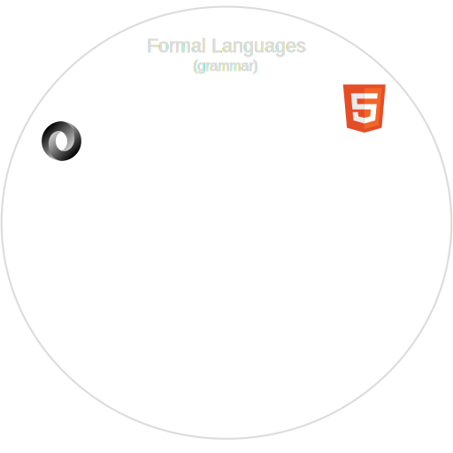
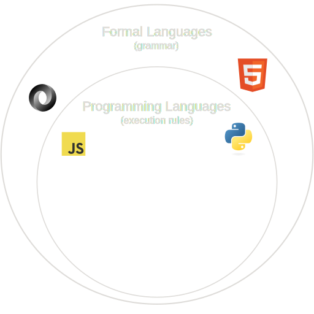
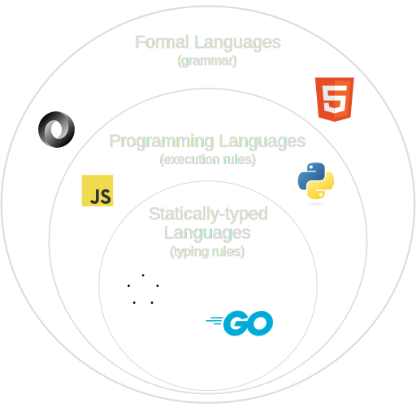
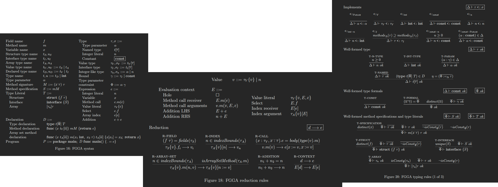
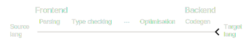

<section
	data-background-image="https://raw.githubusercontent.com/MariaLetta/free-gophers-pack/refs/heads/master/illustrations/svg/15.svg"
	data-background-size="30%"
	data-background-position="bottom right 10px"
	data-transition="none"
>

# Const generics in Go

Contributing to the language

</section>

---

## Hello 👋, I'm Dawid

<div class="grid-container">


<small>
	Gopher drawing created by Takuya Ueda (<a href="https://twitter.com/tenntenn">https://twitter.com/tenntenn</a>).
	Licensed under the
	<a href="https://creativecommons.org/licenses/by/3.0/deed.en">
		Creative Commons 3.0 Attributions license</a>.
</small>
</div>

---

## Outline

<ol>
<li class="fragment">What are const generics?</li>
<li class="fragment">Intro to programming languages & compilers</li>
<li class="fragment">Live coding - parser implementation</li>
</ol>

---

<section
	data-background-image="./img/49.svg"
	data-background-size="18%"
	data-background-position="bottom 70px right 10px"
	data-transition="none"
>

## Background: Arrays

<ul>
	<li class="fragment">
	<pre class="no-background">
		<code class="language-go">var openingHours [7]OpeningHour</code>
	</pre>
	</li>
	<li class="fragment">
		<pre class="no-background">
			<code class="language-go">arrB := arrA</code>
		</pre>
	</li>
	<li class="fragment">
		<pre class="no-background">
			<code class="language-go">arrA == arrB</code>
		</pre>
	</li>
	<li class="fragment">
		<pre class="no-background">
			<code class="language-go">map[[2]int]int{{1, 2}: 3}</code>
		</pre>
	</li>
</ul>

</section>

---

<h2>Problem: Length of an array in Go is part of its type</h2>

<br>

```go
func reversed(arr [5]int) [5]int {
	n := len(arr)
	for i := 0; i < n / 2; i++ {
		arr[i], arr[n-i-1] = arr[n-i-1], arr[i]
	}
	return arr
}
```

---

<h2>Generics in Go<br></h2>

(Griesemer et al., 2020)

```go
func reversed[T any](arr [5]T) [5]T {
	n := len(arr)
	for i := 0; i < n / 2; i++ {
		arr[i], arr[n-i-1] = arr[n-i-1], arr[i]
	}
	return arr
}
```

---

## Current workaround

```go
type array[T any] interface {
	[2]T | [3]T | [4]T | [5]T
}
```


---

<section
	data-background-image="./img/rustacean-flat-happy.svg"
	data-background-size="18%"
	data-background-position="bottom 70px right 20px"
	data-transition="none"
>

## Rust: const generics

Rust already tackled this issue

```rust
struct ArrayPair<T, const N: usize> {
    left: [T; N],
    right: [T; N],
}
```

(The const generics project group, 2021)

</section>

---

## Solution: Numerical type parameters

Type parameters for array sizes

```go
func reversed[T any, N const](arr [N]T) [N]T {
	n := len(arr)
	for i := 0; i < n / 2; i++ {
		arr[i], arr[n-i-1] = arr[n-i-1], arr[i]
	}
	return arr
}
```

---

<section
	data-background-image="https://raw.githubusercontent.com/MariaLetta/free-gophers-pack/refs/heads/master/characters/svg/4.svg"
	data-background-size="18%"
	data-background-position="bottom 70px right 10px"
	data-transition="none"
>

## Const type parameter constraint

```go
type const interface {
	0 | 1 | 2 | 3 | ...
}
```

</section>

---

## Proposal

[https://github.com/golang/go/issues/65555](https://github.com/golang/go/issues/65555)

---

## Programming languages and compilers

<p class="fragment">Implementations of Go:</p>
<ul>
<li class="fragment"><a href="https://github.com/golang/go">gc</a> (main compiler implementation)</li>
<li class="fragment"><a href="https://github.com/golang/gofrontend">gofrontend</a> (alt. frontend used with gcc/llvm backend)</li>
<li class="fragment"><a href="https://github.com/gopherjs/gopherjs">GopherJS</a></li>
</ul>

<figure class="fragment">
<q>The Go language has always been defined by a spec, not an implementation.</q>
<figcaption>
(Taylor, 2012)
</figcaption>
</figure>

---

## Programming languages - a formal perspective

<div class="flex-container">
<div class="flex-item fragment">

Syntax

$T ::= [n]t$ 

</div>
<div class="flex-item fragment">

Reduction

`$$
\begin{array}{c}
   n \in indexBounds(t_A) \\ \hline
   t_A\{\overline{v}\}[n] \to v_n \\
\end{array}
$$`

</div>
<div class="flex-item fragment">

Typing

`$$
\begin{array}{c}
    n \ge 0~~~~~t~~ok\\ \hline
    [n]t~~ok
\end{array}
$$`

</div>

---



---



---



---

## Featherweight Go with Arrays: Formal rules

<li class="fragment">Based on Featherweight Go (Griesemer et al., 2020)</li>



---

## Prototype interpreter

<ul>
<li class="fragment">Dynamically testing the theory</li>
<li class="fragment">Caught two bugs in gc (issues <a href="https://github.com/golang/go/issues/65711">65711</a> and <a href="https://github.com/golang/go/issues/65714">65714</a>)</li>
</ul>

<div class="fragment">

```
reduction step 1: Arr{4, 6}[Foo{3, Arr{1, 2}}.y.first()]
program well typed

reduction step 2: Arr{4, 6}[Arr{1, 2}.first()]
program well typed

reduction step 3: Arr{4, 6}[Arr{1, 2}[0]]
program well typed

reduction step 4: Arr{4, 6}[1]
program well typed

reduction step 5: 6
program well typed
```

</div class="fragment>

---

## Prototype monomorphiser

<div class="flex-item">

```go
func reversed[T any, N const](arr [N]T) [N]T {
    // reversing code...
}
func main() {
    fmt.Println(reversed([5]int{1, 2, 3, 4, 5}))
}
```
</div>

<div class="flex-item">
$\downarrow$
</div>

<div class="flex-item">

```go
func reversed_5[T any](arr [5]T) [5]T {
    // reversing code...
}
func main() {
    fmt.Println(reversed_5([5]int{1, 2, 3, 4, 5}))
}
```

</div>

</div>

---

<section
	data-background-image="https://raw.githubusercontent.com/MariaLetta/free-gophers-pack/refs/heads/master/characters/svg/48.svg"
	data-background-size="23%"
	data-background-position="bottom right 10px"
	data-transition="none"
>

## Compiler pipeline



</section>

---

<section
	data-background-image="./img/45.svg"
	data-background-size="23%"
	data-background-position="bottom 70px right 10px"
	data-transition="none"
>

## Contributing to the Go compiler - live coding

Just one parser happy path!

</section>

---

## Questions

<div class="transparent-flex-container">

<div class="flex-item">

Contact me:

<ul>
<li><a href="linkedin.com/in/dawid-k-lachowicz">LinkedIn: Dawid Lachowicz</a></li>
<li><a href="https://github.com/dawidl022">GitHub: dawidl022</a></li>
</ul>

</div>

</div>

Participate in the proposal discussion: [issue
65555](https://github.com/golang/go/issues/65555)

Detailed writeup and prototype: https://github.com/dawidl022/go-const-generics

---

References:

<small>

Griesemer, R., Hu, R., Kokke, W., Lange, J., Taylor, I.L., Toninho, B., Wadler,
P., and Yoshida, N., 2020. Featherweight Go. Proc. ACM Program. Lang. [Online],
4(OOPSLA). Available from: https://doi.org/10.1145/3428217.

The const generics project group, 2021. Const generics MVP hits beta! [Online].
Rust Blog. Available from:
https://blog.rust-lang.org/2021/02/26/const-generics-mvp-beta.html [Accessed
November 12, 2023].

Talyor, IL., 2012. Gccgo in GCC 4.7.1 [Online]. The Go Blog. Available from:
https://go.dev/blog/gccgo-in-gcc-471 [Accessed October 15, 2024].

</small>


Graphics:

<small>

https://github.com/primer/octicons

https://github.com/golang-samples/gopher-vector

https://github.com/MariaLetta/free-gophers-pack

https://rustacean.net/

</small>
